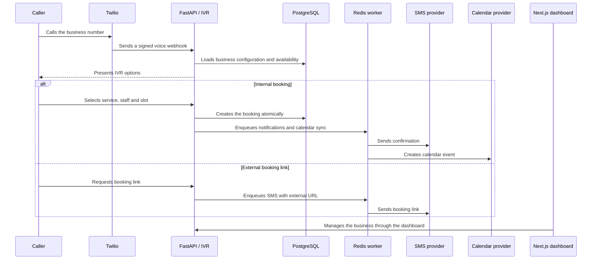
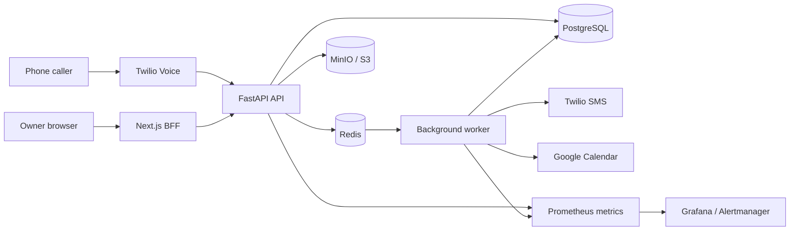

<div align="center">

# 📞 VoxSlot

### Voice-first booking automation for appointment-based businesses

VoxSlot answers missed calls, guides customers through an IVR flow, creates appointments, sends SMS notifications and keeps business operations synchronized.

<br />

[](https://voxslot.up.railway.app/)
[](PROJECT_STATUS.md)
[](ROADMAP.md)

<br />

[](https://github.com/tomekmisiun/appointment-voice-saas/actions/workflows/ci.yml)
[](https://github.com/tomekmisiun/appointment-voice-saas/actions/workflows/deploy.yml)
[](https://github.com/tomekmisiun/appointment-voice-saas/commits/main)
[](https://github.com/tomekmisiun/appointment-voice-saas)
[](https://github.com/tomekmisiun/appointment-voice-saas/issues)

<br />


</div>

---

## Table of contents

- [About](#about)
- [Problem](#problem)
- [How it works](#how-it-works)
- [Key features](#key-features)
- [Architecture](#architecture)
- [Technology stack](#technology-stack)
- [Quick start](#quick-start)
- [Local demo](#local-demo)
- [Testing and validation](#testing-and-validation)
- [Security and reliability](#security-and-reliability)
- [Project status](#project-status)
- [Roadmap](#roadmap)
- [Repository structure](#repository-structure)
- [Documentation](#documentation)
- [Development workflow](#development-workflow)
- [Author](#author)

---

## About

**VoxSlot** is a multi-tenant SaaS platform for salons, barbers, clinics and other appointment-based businesses that lose calls while employees are serving customers.

The system combines:

- a phone IVR,
- an appointment scheduling engine,
- SMS communication,
- calendar synchronization,
- an owner-facing web dashboard,
- production-oriented backend infrastructure.

A caller can book, cancel or reschedule an appointment without waiting for the business owner to answer the phone.

### Operating modes

| Mode | Description |
|---|---|
| **Internal booking** | VoxSlot manages services, staff availability and bookings directly. |
| **External booking link** | The caller receives an SMS link to an external booking platform such as Booksy. |

### At a glance

| Area | Current state |
|---|---|
| Backend domain and scheduling | ✅ Implemented |
| Twilio voice and SMS | ✅ Implemented |
| Calendar integration | ✅ Implemented |
| Local IVR simulation | ✅ Implemented |
| Owner authentication | ✅ Implemented |
| Owner dashboard | 🟡 Functional and expanding |
| Controlled pilot | ✅ Supported |
| Full self-service SaaS | 🟡 In progress |
| Billing and phone provisioning | 🧭 Planned |

---

## Problem

Appointment-based businesses often miss phone calls because staff cannot interrupt a service to answer the phone.

A missed call can mean:

- a lost appointment,
- repeated interruptions,
- manual follow-up,
- unnecessary administrative work,
- a poor customer experience.

VoxSlot moves the first stage of booking from the business owner to an automated voice flow while keeping the final booking data inside one operational system.

---

## How it works



### Typical caller flow

```text
Incoming call
    ↓
Business greeting
    ↓
[1] Book an appointment
[2] Connect to the business
    ↓
Choose service
    ↓
Choose preferred staff or any available employee
    ↓
Choose an available time slot
    ↓
Booking created
    ↓
SMS confirmation + calendar synchronization
```

---

## Key features

| Area | Capabilities |
|---|---|
| **📞 Voice and IVR** | Twilio voice webhooks<br>Signature verification and idempotency<br>Keypad-based navigation<br>Service, staff and slot selection<br>Booking, cancellation and rescheduling<br>Call transfer<br>External booking-link delivery<br>Local IVR simulation |
| **📅 Scheduling** | Business and staff working hours<br>Availability exceptions and closures<br>Recurring staff blocks<br>Timezone and DST handling<br>Multi-service bookings<br>Database-level overlap protection<br>Waitlist offers and escalation |
| **💬 Communication** | Transactional notification outbox<br>Twilio SMS and fake local providers<br>Confirmations, reminders and cancellations<br>Inbound SMS commands<br>Google Calendar adapter<br>Retries, backoff and reconciliation |
| **🖥️ Owner application** | Landing page<br>Registration and authentication<br>Protected dashboard<br>Business setup overview<br>Booking and staff management<br>Typed OpenAPI contract<br>Next.js Backend-for-Frontend<br>Encrypted HttpOnly session |
| **🏢 SaaS platform** | Multi-tenant data model<br>Tenant-scoped authorization<br>Business memberships<br>Role-based access control<br>Audit logging<br>Public and protected endpoint policies |
| **⚙️ Operations** | Redis queues, cache and rate limiting<br>Alembic migrations<br>MinIO / S3-compatible storage<br>Health and readiness checks<br>Prometheus metrics<br>Structured logging and Sentry<br>Docker Compose<br>CI/CD and security workflows |

---

## Architecture



### Main design decisions

| Area | Approach |
|---|---|
| **API** | Versioned FastAPI routes with thin controllers and a service layer |
| **Frontend** | Next.js App Router using a Backend-for-Frontend pattern |
| **Authentication** | Backend JWTs remain server-side inside an encrypted frontend session |
| **Persistence** | PostgreSQL with SQLAlchemy 2.0 and Alembic |
| **Concurrency** | Transactional operations and database-level overlap protection |
| **Async work** | Redis queues with delayed jobs, retries and failed-job handling |
| **Integrations** | Provider interfaces with fake and production adapters |
| **Notifications** | Transactional outbox preserves delivery intent |
| **Tenancy** | Tenant and business scope enforced throughout domain services |
| **API contract** | Frontend TypeScript types generated from backend OpenAPI |
| **Observability** | Health checks, structured logs, metrics and alerts |

---

## Technology stack

### Backend

<p>


</p>

### Frontend

<p>


</p>

### Infrastructure and integrations

<p>


</p>

### Quality and observability

<p>


</p>

---

## Quick start

### Requirements

- Docker and Docker Compose
- Python 3.13+
- [`uv`](https://docs.astral.sh/uv/)
- Node.js 20+
- [`pnpm`](https://pnpm.io/)
- Make

### 1. Clone and configure the repository

```bash
git clone https://github.com/tomekmisiun/appointment-voice-saas.git
cd appointment-voice-saas

cp .env.example .env
```

Set a strong development secret in `.env`:

```env
SECRET_KEY=replace-with-a-strong-random-secret
```

### 2. Start the backend stack

```bash
make bootstrap
make seed-demo
```

### 3. Configure and start the frontend

```bash
cd frontend

pnpm install
cp .env.example .env.local
openssl rand -base64 32
```

Set the generated value in `frontend/.env.local`:

```env
BACKEND_API_URL=http://localhost:8000
SESSION_SECRET=<generated-base64-secret>
APP_ORIGIN=http://localhost:3000
BFF_TRUST_FORWARDED_HEADERS=false
```

Start the frontend:

```bash
pnpm dev
```

### Local services

| Service | Address |
|---|---|
| Frontend | http://localhost:3000 |
| Backend API | http://localhost:8000 |
| Swagger UI | http://localhost:8000/docs |
| Readiness check | http://localhost:8000/health/ready |
| MinIO console | http://localhost:9001 |

### Local development account

```text
Email:    admin@example.local
Password: devpassword123
```

> [!WARNING]
> These credentials are intended only for local development. Never use them in a shared or production environment.

---

## Local demo

Create deterministic demo data:

```bash
make seed-demo
```

The seed creates a sample business with staff, services and working hours.

The IVR can be tested without a real Twilio phone number:

```text
POST /api/v1/ivr/simulate/call
POST /api/v1/ivr/simulate/press
```

This makes it possible to exercise the booking flow locally while using fake SMS and calendar providers.

---

## Testing and validation

### Backend

Run the main validation suite:

```bash
make validate
```

Run tests only:

```bash
make test
```

Run tests in parallel:

```bash
make test-parallel
```

### Frontend

```bash
cd frontend

pnpm lint
pnpm typecheck
pnpm test
pnpm build
```

Verify that generated frontend types match the backend OpenAPI schema:

```bash
pnpm api:check
```

---

## Security and reliability

VoxSlot includes production-oriented safeguards across the API, frontend and asynchronous workers.

| Area | Safeguard |
|---|---|
| **Frontend session** | Encrypted, HttpOnly session cookie |
| **CSRF** | Origin checks for state-changing frontend requests |
| **Authorization** | Tenant and business-level data isolation |
| **Scheduling** | Database-level booking overlap prevention |
| **Webhooks** | Twilio signature verification and idempotency |
| **Notifications** | Transactional outbox |
| **Public endpoints** | Redis-backed rate limiting |
| **Async jobs** | Retries, backoff and failed-job handling |
| **Operations** | Health checks, readiness checks and metrics |
| **Auditability** | Structured audit logs |
| **Supply chain** | Dependency review and secret scanning |
| **Recovery** | Scheduled backups and restore rehearsals |

---

## Project status

| Area | Status |
|---|---|
| Backend domain and scheduling engine | ✅ Available |
| Voice IVR and Twilio adapters | ✅ Available |
| SMS and calendar integrations | ✅ Available |
| Local end-to-end demo | ✅ Available |
| Owner registration and authentication | ✅ Available |
| Owner dashboard | 🟡 Functional, actively expanding |
| Controlled pilot deployment | ✅ Supported |
| Full self-service SaaS operations | 🟡 In progress |
| Public read-only product demo | 🟡 In progress |
| Subscription billing | 🧭 Planned |
| Automated phone provisioning | 🧭 Planned |

> [!NOTE]
> The repository is suitable as a portfolio project, complete local demo and controlled pilot. It is not yet presented as a finished, generally available commercial SaaS.

See [`PROJECT_STATUS.md`](PROJECT_STATUS.md) for the evidence-backed implementation status.

---

## Roadmap

Current development areas:

- completing owner dashboard management screens,
- public read-only demo access,
- staff accounts and business permissions,
- owner metrics and CSV exports,
- payment and deposit workflows,
- subscription billing and plan enforcement,
- automated phone-number provisioning,
- deeper calendar synchronization,
- operational integration reconciliation.

More details:

- [`ROADMAP.md`](ROADMAP.md)
- [`TECH_DEBT.md`](TECH_DEBT.md)
- [`docs/appointment-saas-roadmap.md`](docs/appointment-saas-roadmap.md)

---

## Repository structure

```text
.
├── app/
│   ├── api/             # FastAPI routes and dependencies
│   ├── core/            # Configuration, security, middleware and metrics
│   ├── models/          # SQLAlchemy domain models
│   ├── schemas/         # Pydantic request and response schemas
│   ├── services/        # Domain logic and provider abstractions
│   └── worker.py        # Redis background worker
│
├── frontend/
│   ├── app/             # Next.js pages and BFF endpoints
│   ├── components/      # Shared UI and marketing components
│   ├── features/        # Auth, dashboard, bookings and staff
│   ├── lib/             # API contract, session and validation
│   └── tests/           # Frontend test utilities and mocks
│
├── alembic/             # Database migrations
├── tests/               # Backend unit, integration and smoke tests
├── docs/                # Product documentation, audits and runbooks
├── observability/       # Prometheus, Grafana and alert configuration
├── perf/                # Load-test baselines
├── scripts/             # Deployment, backup, CI and operational scripts
└── .github/workflows/   # CI, deploy, backup, release and security workflows
```

---

## Documentation

| Document | Purpose |
|---|---|
| [`PROJECT_STATUS.md`](PROJECT_STATUS.md) | Verified implementation and readiness status |
| [`ROADMAP.md`](ROADMAP.md) | High-level product roadmap |
| [`TECH_DEBT.md`](TECH_DEBT.md) | Known gaps and technical debt |
| [`docs/product-scope.md`](docs/product-scope.md) | Product problem, users and scope |
| [`docs/domain-model.md`](docs/domain-model.md) | Domain terminology and relationships |
| [`docs/appointment-saas-roadmap.md`](docs/appointment-saas-roadmap.md) | Detailed implementation backlog |
| [`docs/mvp-pilot-deployment-checklist.md`](docs/mvp-pilot-deployment-checklist.md) | Pilot deployment checklist |
| [`docs/twilio-provider-runbook.md`](docs/twilio-provider-runbook.md) | Twilio integration runbook |
| [`docs/learning/`](docs/learning/) | Codebase mental maps and learning notes |

---

## Development workflow

The repository follows these rules:

- one task per branch,
- Conventional Commits,
- targeted tests before broad validation,
- full validation before merge,
- CI policy guards,
- cross-provider AI-assisted review rules.

Read these files before making automated changes:

- [`AGENTS.md`](AGENTS.md)
- [`CLAUDE.md`](CLAUDE.md)
- [`.ai-rules/`](.ai-rules/)

---

## Author

<div align="center">

### Tomasz Misiun

[](https://github.com/tomekmisiun)
[](https://voxslot.up.railway.app/)

<br />

Built as a production-oriented portfolio project and evolving SaaS product.

</div>

---

<div align="center">

**This repository is under active development.**

No open-source license is currently included.

[Back to top](#-voxslot)

</div>
