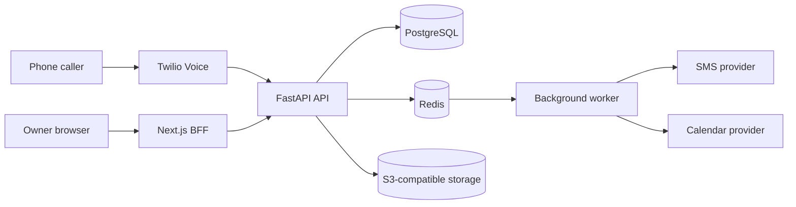

# VoxSlot

Voice-first booking automation for appointment-based businesses. VoxSlot is a
multi-tenant SaaS product that can answer calls through an IVR flow, create and
manage appointments, send SMS notifications, and expose an owner dashboard.

Current lifecycle: active portfolio/pilot project. The local demo and core
backend flows are implemented; the project is not documented as production-ready
because production readiness gaps remain.

[](https://github.com/tomekmisiun/appointment-voice-saas/actions/workflows/ci.yml)
[](https://github.com/tomekmisiun/appointment-voice-saas/actions/workflows/deploy.yml)

## Contents

- [Overview](#overview)
- [Implemented Capabilities](#implemented-capabilities)
- [Architecture](#architecture)
- [Technology Stack](#technology-stack)
- [Quick Start](#quick-start)
- [Configuration](#configuration)
- [Testing](#testing)
- [Deployment](#deployment)
- [Status And Limitations](#status-and-limitations)
- [Documentation](#documentation)
- [Security](#security)

## Overview

Appointment-based businesses lose bookings when staff cannot answer the phone.
VoxSlot moves the first booking interaction into an automated voice flow while
keeping booking data in the product database.

Main flows:

- a caller books, cancels, reschedules, or requests transfer through IVR,
- the backend creates or updates appointments with database overlap protection,
- SMS and calendar work are queued through Redis-backed workers,
- owners use a Next.js dashboard for login, bookings, and staff views,
- a public read-only demo can be enabled through dedicated demo settings.

## Implemented Capabilities

| Area | Current state |
|---|---|
| Backend domain | Tenants, users, businesses, staff, services, hours, exceptions, recurring blocks, bookings, clients, customers, waitlist, audit logs. |
| Scheduling | Availability generation, timezone handling, business/staff hours intersection, booking overlap protection. |
| IVR | Twilio webhooks, local simulator endpoints, service/staff/slot selection, cancel/reschedule, transfer branch, invalid/no-input handling. |
| Notifications | SMS outbox, fake/null/Twilio providers, reminders, inbound SMS commands, retries and failed-job tracking. |
| Calendar | Calendar event model, fake provider, queued sync, retry/DLQ behavior. Real OAuth setup is not implemented. |
| Frontend | Landing, register/login, demo page, protected dashboard, bookings list/detail actions, staff management. |
| Operations | Docker Compose local stack, Alembic migrations, Redis worker, health/readiness checks, Prometheus metrics, CI policy guards. |

## Architecture



Detailed architecture: [`docs/architecture/overview.md`](docs/architecture/overview.md).

## Technology Stack

| Area | Technology | Purpose |
|---|---|---|
| Backend | Python 3.13, FastAPI, Pydantic, SQLAlchemy, Alembic | API, schemas, persistence, migrations. |
| Frontend | Next.js 16, React 19, TypeScript, pnpm, Tailwind CSS | Owner dashboard and BFF routes. |
| Database | PostgreSQL 17 | Relational source of truth. |
| Queue/cache | Redis 7 | Rate limits, cache, idempotency, jobs, delayed work. |
| Storage | S3-compatible storage, MinIO locally | Presigned file upload/download. |
| Integrations | Twilio, provider-style calendar adapters, Sentry optional | Voice/SMS, calendar sync boundary, error tracking. |
| Tests | pytest, pytest-cov, pytest-xdist, Vitest, React Testing Library | Backend and frontend validation. |
| Tooling | Docker Compose, uv, Ruff, GitHub Actions, Trivy, gitleaks | Local runtime, quality, CI/security checks. |

## Quick Start

Requirements:

- Docker and Docker Compose
- Python 3.13+
- `uv`
- Node.js 22.13+
- `pnpm` 11.8+
- Make

From the repository root:

```bash
cp .env.example .env
make bootstrap
make seed-demo
```

Frontend setup:

```bash
cd frontend
pnpm install
cp .env.example .env.local
openssl rand -base64 32
pnpm dev
```

Put the generated secret in `frontend/.env.local` as `SESSION_SECRET`.

Local URLs:

| Service | URL |
|---|---|
| Frontend | `http://localhost:3000` |
| Backend API | `http://localhost:8000` |
| Swagger UI | `http://localhost:8000/docs` |
| Readiness | `http://localhost:8000/health/ready` |
| MinIO console | `http://localhost:9001` |

Seeded local account:

```text
Email: admin@example.local
Password: devpassword123
```

These credentials are for local development only.

## Configuration

Backend configuration starts from `.env.example`; frontend configuration starts
from `frontend/.env.example`. Do not commit `.env` or `.env.local`.

Detailed configuration: [`docs/operations/configuration.md`](docs/operations/configuration.md).

## Testing

Backend validation from the repository root:

```bash
make validate
make policy-guards
```

Frontend validation from `frontend/`:

```bash
pnpm lint
pnpm typecheck
pnpm test
pnpm build
pnpm api:check
```

Detailed test guidance: [`docs/testing/README.md`](docs/testing/README.md).

## Deployment

The active deployment path is Railway:

- API: `railway.api.toml`
- worker: `railway.worker.toml`
- frontend: `frontend/railway.toml`
- automatic production deployment from `.github/workflows/ci.yml` on `main`
  after the CI gate passes

`docker-compose.prod.yml` is only a minimal API/worker runtime example; it does
not include PostgreSQL, Redis, object storage, TLS, or migrations.

Detailed deployment guidance: [`docs/operations/deployment.md`](docs/operations/deployment.md).

## Status And Limitations

Current source of truth: [`docs/project/current-state.md`](docs/project/current-state.md).

Important current limitations:

- production readiness is not claimed,
- production API status must be verified before relying on the public demo,
- `BusinessMembership.role` is stored but not yet used for runtime RBAC,
- real calendar OAuth/setup is not implemented,
- public booking management links, billing, phone provisioning, and several
  owner configuration screens remain future work,
- browser-driven E2E tests are not implemented.

Planning and debt:

- [`PROJECT_STATUS.md`](PROJECT_STATUS.md)
- [`ROADMAP.md`](ROADMAP.md)
- [`TECH_DEBT.md`](TECH_DEBT.md)

## Documentation

Start with [`docs/README.md`](docs/README.md). It indexes architecture, API,
configuration, testing, deployment, operations, security, ADRs, specs, runbooks,
and archived historical audits.

## Security

Security overview: [`docs/security/overview.md`](docs/security/overview.md).

Security-sensitive details:

- local secrets stay in `.env` and `frontend/.env.local`,
- production settings reject weak/local defaults,
- Twilio and generic webhooks use signature verification,
- demo sessions are read-only when configured,
- CI includes secret scanning and dependency/container checks.

No open-source license file is currently included.
