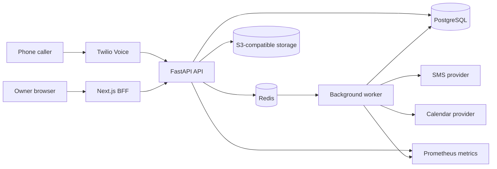

# Architecture

VoxSlot is a multi-tenant appointment booking product with a FastAPI backend,
a Next.js owner dashboard, PostgreSQL persistence, Redis-backed queues/cache,
and provider adapters for voice, SMS, storage, and calendar work.

## Component Overview

## Runtime Components

| Component | Location | Responsibility |
|---|---|---|
| FastAPI API | [`app/main.py`](../../app/main.py) | HTTP API, middleware, OpenAPI, health, metrics, domain routes. |
| API router | [`app/api/v1.py`](../../app/api/v1.py) | Canonical `/api/v1` route registration. |
| Service layer | [`app/services/`](../../app/services/) | Booking, availability, IVR, SMS, calendar, tenancy, and domain logic. |
| Models | [`app/models/`](../../app/models/) | SQLAlchemy entities and enums. |
| Worker | [`app/worker.py`](../../app/worker.py) | Redis job polling, retries, scheduled maintenance, notification/calendar work. |
| Frontend | [`frontend/app/`](../../frontend/app/) | Next.js App Router pages and BFF route handlers. |
| API types | [`frontend/lib/api/`](../../frontend/lib/api/) | OpenAPI JSON and generated TypeScript schema. |
| Migrations | [`alembic/versions/`](../../alembic/versions/) | Database schema evolution. |
| Observability | [`observability/`](../../observability/) | Prometheus, Grafana, Loki, Promtail, Alertmanager config. |

## Request Boundaries

- Browser traffic goes to the Next.js app. Backend access from the frontend is
  server-side through the BFF and `BACKEND_API_URL`.
- Backend product API routes are under `/api/v1`; `/health/*`, `/metrics`,
  `/docs`, and `/openapi.json` are not under the versioned prefix.
- Legacy unversioned routes exist only when `LEGACY_ROUTES_ENABLED` is true.
  The default is enabled outside production and disabled in production.
- Protected backend routes use Bearer JWT auth. The frontend stores backend
  tokens inside an encrypted HttpOnly session cookie.

## Main Product Flows

| Flow | Implementation |
|---|---|
| Signup | `POST /api/v1/signup` creates a tenant and first admin user. |
| Owner login | Next.js BFF calls backend auth and stores the resulting session server-side. |
| Manual booking | Owner/API creates bookings under `/api/v1/businesses/{business_id}/bookings`. |
| Voice booking | Twilio posts to `/api/v1/webhooks/twilio/voice`; IVR service manages `VoiceSession` state and creates bookings. |
| SMS | Booking lifecycle writes `NotificationOutbox` rows; worker sends through fake/null/Twilio providers. |
| Calendar | Worker syncs `CalendarEvent` records through a provider adapter; PostgreSQL remains the booking source of truth. |
| Demo | `POST /api/v1/auth/demo` creates a read-only demo session when public demo settings are configured. |

## Persistence And Concurrency

- PostgreSQL is the source of truth for tenants, users, businesses, staff,
  services, working hours, bookings, clients, waitlist entries, audit logs,
  uploaded files, calendar integration state, and notification outbox rows.
- Alembic tracks schema changes. Current migration head is documented in
  [`CURRENT_STATE.md`](../project/current-state.md).
- Booking overlap protection is enforced at the database level with a GiST
  exclusion constraint in the booking migration chain.
- Redis is required for rate limiting, cache, idempotency, job queues, delayed
  jobs, failed-job tracking, and worker maintenance coordination.

## Integrations

| Integration | Current implementation |
|---|---|
| Twilio Voice | Webhooks, TwiML adapter, signature validation, phone-number routing by `To`. |
| Twilio SMS | Provider adapter, status webhook, inbound SMS commands. |
| Calendar | Provider abstraction and fake provider; no active real OAuth flow or frontend setup screen. |
| S3-compatible storage | Presigned upload/download flow; MinIO is used locally. |
| Sentry | Optional error tracking via `SENTRY_DSN`. |
| Prometheus/Grafana/Loki | Local observability stack and metric endpoints. |

## Important Limitations

- `BusinessMembership.role` exists but runtime authorization still uses
  `User.role`; per-business RBAC cutover is future work.
- `BusinessPhoneNumber` and `telephony_status` are not on `main`; Twilio voice
  routing currently matches `To` against `businesses.phone`.
- Calendar models and fake provider exist, but real provider OAuth/setup is not
  implemented.
- Multi-service booking tables and availability logic exist, but the IVR and
  primary booking create API are not fully multi-service workflows.
- Production readiness is blocked by items listed in
  [`CURRENT_STATE.md`](../project/current-state.md) and [`../TECH_DEBT.md`](../../TECH_DEBT.md).

## Design Records

See [`adr/README.md`](../adr/README.md) for decisions covering sync architecture,
provider boundaries, recurring staff blocks, payment holds, calendar sync, staff
identity separation, and public demo access.

