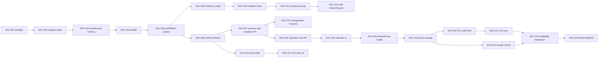

> [!WARNING]
> Dokument archiwalny. Nie opisuje aktualnego źródła prawdy.
> Aktualna dokumentacja: [Documentation index](../../README.md).

# Staff Access, Scheduling, and Calendar Integrations Roadmap

- **Epic:** AVS-M / Staff Access, Scheduling, and Calendar Integrations
- **Status:** planned
- **Rule:** one task equals one branch and one independently reviewable change
- **Architecture:** [`docs/specs/staff-access-and-calendar.md`](../../specs/staff-access-and-calendar.md)
- **Current state:** [`docs/project/current-state.md`](../../project/current-state.md)
- **Historical audit:** [`docs/archive/audits/staff-access-calendar-current-state.md`](../audits/staff-access-calendar-current-state.md)

The canonical status summary remains
[`docs/project/implementation-backlog.md`](../../project/implementation-backlog.md). This file
contains the expanded execution cards referenced by that roadmap. Tasks must
not be marked complete until code, migrations, tests, docs, and required review
are merged and verified.

## Delivery scope

- **MVP:** SAC-001 through SAC-017. Local staff access works without any
  external calendar.
- **Pilot:** SAC-018 through SAC-021. Read-only ICS busy import is enabled for a
  controlled cohort.
- **Can wait:** SAC-022. Google OAuth read-only import follows the same busy
  model after ICS validates it.
- **Production hardening:** SAC-023 and SAC-024.
- **Deferred:** external write-back, booking mutation from external calendars,
  drag/drop, calendar webhooks, multi-calendar merge, leave approval, payroll.

## Dependency chain

## Phase 0: Migration evidence

### SAC-001 - Membership and staff data preflight

- **Status / class / risk:** planned / MVP / low.
- **Goal:** produce deterministic counts and ambiguity reports before schema
  design is frozen.
- **Scope:** read-only query/script for users per tenant/business, duplicate
  cross-tenant emails, current admins, signup ownership evidence, staff contact
  candidates, orphan/mismatched staff references, and existing integrations.
- **Out of scope:** schema or data mutation; automatic identity/staff linking.
- **Dependencies:** ADR 0007 and current-state audit.
- **Suggested branch:** `audit/sac-001-membership-data-preflight`.
- **Backend / frontend / database changes:** backend read-only audit command and
  tests / none / no DDL or writes.
- **Security considerations:** reports contain sensitive identifiers; mask
  emails/phones in logs and keep raw output out of git.
- **Acceptance criteria:** repeatable report distinguishes safe rows from every
  manual-resolution category and documents production execution.
- **Tests:** fixture-based query tests, tenant-scope assertions, empty/duplicate
  datasets.
- **Definition of done:** targeted tests and `make validate` pass; report format
  reviewed; roadmap evidence linked.

### SAC-002 - Expand/backfill/contract migration runbook

- **Status / class / risk:** planned / MVP / medium.
- **Goal:** define reversible sequencing for membership and role cutover.
- **Scope:** migration/backfill spec, owner inference rules, dual-read metrics,
  session invalidation, rollback checkpoints, and backup/restore rehearsal.
- **Out of scope:** Alembic migration or runtime code.
- **Dependencies:** SAC-001.
- **Suggested branch:** `docs/sac-002-membership-migration-runbook`.
- **Backend / frontend / database changes:** docs only / docs only / planned DDL
  and backfill SQL, no execution.
- **Security considerations:** never auto-link by email; require operator
  resolution for ambiguous owner/user/staff cases.
- **Acceptance criteria:** every legacy role/state has forward and rollback
  treatment; destructive contract is a separate later branch.
- **Tests:** dry-run examples against anonymized fixture states; docs validators.
- **Definition of done:** DB/security reviewers accept sequencing and failure
  recovery.

## Phase 1: Membership and authorization

### SAC-003 - Business membership schema

- **Status / class / risk:** planned / MVP / high.
- **Goal:** persist business-scoped access and optional staff linkage.
- **Scope:** model, enum/status, migration, unique/partial constraints, indexes,
  relationships, schemas, and model tests.
- **Out of scope:** auth cutover, backfill, invitations, UI.
- **Dependencies:** SAC-002.
- **Suggested branch:** `feat/sac-003-business-memberships`.
- **Backend / frontend / database changes:** model/schema exports / generated
  types only if required / additive table and constraints.
- **Security considerations:** staff role requires same-scope staff link; owner
  role cannot be created through generic staff paths.
- **Acceptance criteria:** database rejects duplicate user/business and active
  staff links; no cascade deletes business history.
- **Tests:** model, migration upgrade/downgrade, constraint, tenant mismatch.
- **Definition of done:** `make validate`, migration checks, architecture docs
  updated with actual names.

### SAC-004 - Membership backfill and legacy compatibility

- **Status / class / risk:** planned / MVP / high.
- **Goal:** populate memberships without changing authorization behavior yet.
- **Scope:** idempotent backfill, owner/admin mapping, unresolved-user state,
  verification counts, rollback, and dual-representation consistency checks.
- **Out of scope:** removing `User.tenant_id`/`role`; automatic staff linking.
- **Dependencies:** SAC-001, SAC-003.
- **Suggested branch:** `feat/sac-004-membership-backfill`.
- **Backend / frontend / database changes:** compatibility helpers / none /
  data migration and validation constraints.
- **Security considerations:** fail closed on ambiguity; do not broaden access
  or promote multiple owners without evidence.
- **Acceptance criteria:** every current user is accounted for; rerun is safe;
  counts reconcile; rollback restores pre-cutover behavior.
- **Tests:** migration fixture matrix, idempotency, duplicate-email cases.
- **Definition of done:** restore rehearsal and migration validation pass.

### SAC-005 - Membership authorization context and RBAC

- **Status / class / risk:** planned / MVP / high.
- **Goal:** make active membership and role authoritative in backend requests.
- **Scope:** authorization context, owner/admin/staff permissions, membership
  status checks, self-scope helpers, token/session invalidation, route migration,
  and tenant/business IDOR tests.
- **Out of scope:** invitation and staff UI; removing legacy columns.
- **Dependencies:** SAC-004.
- **Suggested branch:** `feat/sac-005-membership-rbac-context`.
- **Backend / frontend / database changes:** auth dependencies/services/routes /
  mirrored role types only / optional authorization-version field.
- **Security considerations:** backend reloads role/status; `/me` derives staff;
  role changes and revoke invalidate sessions; platform admin remains separate.
- **Acceptance criteria:** complete RBAC matrix passes; current broad user reads
  no longer grant future staff access to coworkers.
- **Tests:** role matrix, 401/403/404, cross-tenant/business/object substitution,
  stale token, revoked/suspended membership.
- **Definition of done:** all protected product routes declare intentional
  policy and `make validate` passes.

## Phase 2: Employee domain and management API

### SAC-006 - Staff profile lifecycle and history safety

- **Status / class / risk:** planned / MVP / medium.
- **Goal:** complete the employee record without coupling it to login.
- **Scope:** contact email, position, bookable/visible flags, explicit
  deactivate/reactivate services, history-safe FK/delete policy, audit actions.
- **Out of scope:** service assignments, invitations, UI.
- **Dependencies:** SAC-005.
- **Suggested branch:** `feat/sac-006-staff-profile-lifecycle`.
- **Backend / frontend / database changes:** model/schemas/service/routes / type
  refresh / additive staff columns and indexes.
- **Security considerations:** owner/admin only; normalized contact email is not
  proof of identity; deactivation cannot erase bookings.
- **Acceptance criteria:** inactive staff cannot receive new assignments but
  historical booking reads remain intact.
- **Tests:** lifecycle, permissions, history retention, tenant/business scope.
- **Definition of done:** migration and targeted/full validation pass.

### SAC-007 - Staff services and schedule management API

- **Status / class / risk:** planned / MVP / medium.
- **Goal:** let owner/admin manage employee capabilities and regular schedule.
- **Scope:** staff-service relation, assignment API, staff schedule read/write,
  recurring breaks and explicit validation reuse.
- **Out of scope:** staff self-edit of regular schedule; calendar UI.
- **Dependencies:** SAC-006.
- **Suggested branch:** `feat/sac-007-staff-services-schedule-api`.
- **Backend / frontend / database changes:** services/routes/schemas / types /
  join table plus constraints.
- **Security considerations:** every referenced service/staff/schedule must
  share tenant and business; idempotent replacement.
- **Acceptance criteria:** assigned services constrain eligible staff and
  schedules preserve current availability precedence.
- **Tests:** assignment/schedule CRUD, cross-scope IDs, overlaps, availability
  regression.
- **Definition of done:** model/API docs and `make validate` pass.

### SAC-008 - Employee management API contract hardening

- **Status / class / risk:** planned / MVP / medium.
- **Goal:** expose complete owner/admin employee operations with stable errors.
- **Scope:** list/detail filters, access-status projection, deactivate/reactivate,
  bounded calendar link metadata, 401/403/404/409 contract, pagination.
- **Out of scope:** invitations and integration secret management.
- **Dependencies:** SAC-006, SAC-007.
- **Suggested branch:** `feat/sac-008-employee-management-api`.
- **Backend / frontend / database changes:** routes/read DTOs/OpenAPI / generated
  or local types / none beyond prior tasks.
- **Security considerations:** 404 hides cross-scope IDs; no secret or role
  mutation in employee profile payload.
- **Acceptance criteria:** owner/admin workflows are API-complete and staff is
  denied all all-employee routes.
- **Tests:** contract snapshots, pagination, RBAC and IDOR matrix.
- **Definition of done:** OpenAPI/types and targeted/full validation pass.

## Phase 3: Invitation and access lifecycle

### SAC-009 - Staff invitation model and token primitives

- **Status / class / risk:** planned / MVP / high.
- **Goal:** persist a secure, auditable one-time invitation lifecycle.
- **Scope:** invitation model/migration, token generation/hash/compare, expiry,
  status helpers, uniqueness, audit actions.
- **Out of scope:** send/accept endpoints and email delivery.
- **Dependencies:** SAC-003, SAC-006.
- **Suggested branch:** `feat/sac-009-staff-invitation-model`.
- **Backend / frontend / database changes:** model/security/service primitives /
  none / invitation table and indexes.
- **Security considerations:** 256-bit random token, hash only, owner role
  prohibited, tenant/business/staff/email binding.
- **Acceptance criteria:** raw token cannot be recovered; duplicate active
  invitation and replay states are constrained.
- **Tests:** entropy shape, hash comparison, expiry/revoke, constraints.
- **Definition of done:** migration/security review and `make validate` pass.

### SAC-010 - Invite, resend, revoke, and email delivery

- **Status / class / risk:** planned / MVP / high.
- **Goal:** let owner/admin safely manage invitation delivery.
- **Scope:** endpoints, rate limits, transactional revoke-and-resend, outbox/job,
  email template, generic responses, access status projection.
- **Out of scope:** accepting invitation; admin/owner invitation flow.
- **Dependencies:** SAC-008, SAC-009.
- **Suggested branch:** `feat/sac-010-staff-invitation-delivery`.
- **Backend / frontend / database changes:** API/email/worker/audit / BFF types /
  no new table beyond SAC-009.
- **Security considerations:** no password/raw-token logs; URL uses configured
  trusted origin; actor/staff/email/IP rate limits.
- **Acceptance criteria:** resend invalidates old token; revoke is idempotent;
  failed delivery is observable/retryable.
- **Tests:** permissions, rate limit, log redaction, worker retry, old-token
  rejection.
- **Definition of done:** targeted worker/API tests and full validation pass.

### SAC-011 - Invitation acceptance and existing identity linking

- **Status / class / risk:** planned / MVP / high.
- **Goal:** atomically create/link identity, membership, and staff record.
- **Scope:** public token validation, set-password path, authenticated existing
  identity link, row locking, uniqueness conflict handling, session policy.
- **Out of scope:** email-change workflow and global duplicate-account merge.
- **Dependencies:** SAC-005, SAC-010.
- **Suggested branch:** `feat/sac-011-accept-staff-invitation`.
- **Backend / frontend / database changes:** auth/service/endpoint / acceptance
  BFF and page / membership/invitation transaction only.
- **Security considerations:** single-use atomic acceptance, generic errors,
  email binding, no owner escalation, CSRF on authenticated link.
- **Acceptance criteria:** concurrent replay yields one membership; existing
  identity must authenticate; consumed/revoked/expired tokens fail safely.
- **Tests:** race, replay, mismatch, cross-tenant, existing/new identity,
  rollback on partial failure.
- **Definition of done:** security reviewer verdict clear and validation green.

## Phase 4: Frontend access surfaces

### SAC-012 - Owner/admin employee management frontend

- **Status / class / risk:** planned / MVP / medium.
- **Goal:** provide list/create/detail/profile/services/schedule/access workflows.
- **Scope:** server-loaded routes, forms, tabs, invite/resend/revoke/status,
  deactivate/reactivate, BFF handlers, responsive/accessibility states.
- **Out of scope:** advanced calendar editing and integration setup.
- **Dependencies:** SAC-008, SAC-010.
- **Suggested branch:** `feat/sac-012-employee-management-ui`.
- **Backend / frontend / database changes:** none unless contract defect / pages,
  components, BFF, tests / none.
- **Security considerations:** hide by role for UX but rely on backend; CSRF on
  writes; do not expose raw invite links after delivery.
- **Acceptance criteria:** owner/admin complete MVP workflows; staff direct URL
  receives forbidden; mobile and desktop are usable.
- **Tests:** components, routes, 401 refresh, 403, form errors, visual E2E.
- **Definition of done:** lint/type/test/build and screenshot checks pass.

### SAC-013 - Staff session context, route guards, and navigation

- **Status / class / risk:** planned / MVP / high.
- **Goal:** create a self-scoped staff panel foundation.
- **Scope:** membership/session DTO, staff layout/nav, server guard, BFF context,
  forbidden/no-link/revoked states, owner/admin linked-staff access behavior.
- **Out of scope:** calendar/profile/time-off feature pages.
- **Dependencies:** SAC-005, SAC-011.
- **Suggested branch:** `feat/sac-013-staff-portal-foundation`.
- **Backend / frontend / database changes:** session context endpoint if needed /
  route group/layout/BFF / none.
- **Security considerations:** direct URL always reaches backend authorization;
  refresh cannot revive revoked membership.
- **Acceptance criteria:** role-specific navigation and deterministic 401/403
  behavior; staff cannot render owner pages.
- **Tests:** layout/route/BFF/session revoke, role navigation, E2E direct URLs.
- **Definition of done:** frontend validation and backend auth tests pass.

### SAC-014 - Own profile and assigned services

- **Status / class / risk:** planned / MVP / low.
- **Goal:** let linked staff view their profile and safely edit allowed fields.
- **Scope:** `/me/staff-profile` read/allowlisted patch, assigned services/hours,
  profile page and form.
- **Out of scope:** role, email identity, prices, service assignment, regular
  schedule editing.
- **Dependencies:** SAC-007, SAC-013.
- **Suggested branch:** `feat/sac-014-staff-own-profile`.
- **Backend / frontend / database changes:** self endpoint / page+BFF / none.
- **Security considerations:** derive staff ID; reject mass assignment; audit
  mutable contact fields.
- **Acceptance criteria:** only documented safe fields change and coworkers are
  inaccessible.
- **Tests:** schema allowlist, self-scope/IDOR, component/BFF tests.
- **Definition of done:** targeted and full relevant validation pass.

## Phase 5: Local calendar and autonomy

### SAC-015 - Self-scoped calendar read API

- **Status / class / risk:** planned / MVP / high.
- **Goal:** provide a bounded local agenda projection for staff and management.
- **Scope:** date-range booking filters, calendar DTO/service, own endpoint,
  owner/admin staff endpoint, timezone/status/type/customer-field policy.
- **Out of scope:** mutations, external busy, persisted local events, drag/drop.
- **Dependencies:** SAC-005, SAC-007.
- **Suggested branch:** `feat/sac-015-staff-calendar-read-api`.
- **Backend / frontend / database changes:** query/read service/routes / types /
  indexes only if query plan requires them.
- **Security considerations:** own staff derived; minimal customer data;
  bounded ranges; cross-scope 404.
- **Acceptance criteria:** agenda accurately represents bookings, time off/
  exceptions, and blocks in business timezone.
- **Tests:** range boundaries, DST, statuses, privacy, role/IDOR, query count.
- **Definition of done:** API docs and `make validate` pass.

### SAC-016 - Staff agenda and week calendar UI

- **Status / class / risk:** planned / MVP / medium.
- **Goal:** make the local calendar usable without external integration.
- **Scope:** agenda mobile default, week desktop view, day/range navigation,
  loading/empty/error states, booking/time-off/block distinction.
- **Out of scope:** drag/drop, resize, create/edit booking from calendar.
- **Dependencies:** SAC-013, SAC-015.
- **Suggested branch:** `feat/sac-016-staff-calendar-ui`.
- **Backend / frontend / database changes:** none / Server page, bounded client
  navigation, accessible components, tests / none.
- **Security considerations:** render only DTO fields; no hidden coworker data.
- **Acceptance criteria:** responsive agenda/week views have stable dimensions,
  no overlap, keyboard/focus support, and correct timezone.
- **Tests:** components, BFF/range navigation, desktop/mobile E2E screenshots.
- **Definition of done:** lint/type/test/build and visual verification pass.

### SAC-017 - Staff own time-off CRUD

- **Status / class / risk:** planned / MVP / medium.
- **Goal:** let staff manage only their own future absences.
- **Scope:** explicit time-off model or typed local exclusion, self CRUD,
  conflict/lifecycle rules, availability integration, UI and audit.
- **Out of scope:** approval workflows, past edits, other staff, recurring leave.
- **Dependencies:** SAC-014, SAC-015.
- **Suggested branch:** `feat/sac-017-staff-own-time-off`.
- **Backend / frontend / database changes:** model/service/routes / page/form/BFF /
  time-off table or approved additive representation.
- **Security considerations:** derive staff ID; future-only mutation; safe reason
  visibility; race-safe availability behavior.
- **Acceptance criteria:** create/update/delete immediately affects own offered
  slots and calendar; owner/admin sees the exclusion.
- **Tests:** lifecycle, overlaps, timezone/DST, IDOR, availability, UI.
- **Definition of done:** migration/full validation and E2E flow pass.

## Phase 6: External calendar foundation and ICS pilot

### SAC-018 - Normalized external busy-period model

- **Status / class / risk:** planned / Pilot / medium.
- **Goal:** represent privacy-minimal, expiring external exclusions.
- **Scope:** integration direction/status evolution, busy model, indexes,
  idempotency key, retention/expiry, repository/service tests.
- **Out of scope:** fetching providers and availability subtraction.
- **Dependencies:** SAC-015, ADR 0008.
- **Suggested branch:** `feat/sac-018-external-busy-periods`.
- **Backend / frontend / database changes:** models/services/schemas / safe status
  types / additive integration/busy migrations.
- **Security considerations:** no event details; strict scope; derived data can
  be purged without touching bookings.
- **Acceptance criteria:** duplicate imports upsert; disconnect/expiry removes
  effective periods; range query is indexed.
- **Tests:** model constraints, idempotency, tenancy, retention.
- **Definition of done:** migrations and full validation pass.

### SAC-019 - Versioned encrypted integration secrets

- **Status / class / risk:** planned / Pilot / high.
- **Goal:** provide backend at-rest protection and redaction before credentials.
- **Scope:** envelope encryption interface, versioned key config/validation,
  encrypt/decrypt/rotate workflow, redacted schema/log/audit helpers, runbook.
- **Out of scope:** ICS/Google connection flows and managed KMS vendor adapter.
- **Dependencies:** SAC-018.
- **Suggested branch:** `feat/sac-019-calendar-secret-storage`.
- **Backend / frontend / database changes:** crypto/config/service/runbook / safe
  DTO only / ciphertext/key-version columns.
- **Security considerations:** no plaintext persistence/logging; authenticated
  encryption; rotation and lost-key recovery; production validators.
- **Acceptance criteria:** secrets round-trip, tampering fails, old key rotates,
  APIs/logs never reveal values.
- **Tests:** crypto vectors, tamper/rotation, config fail-fast, log capture.
- **Definition of done:** security review, runbook, policy/full validation pass.

### SAC-020 - SSRF-safe ICS connection and parser

- **Status / class / risk:** planned / Pilot / high.
- **Goal:** validate and test a private HTTPS ICS feed without network pivot.
- **Scope:** URL intake/masking, safe DNS/IP/redirect fetcher, egress guidance,
  byte/time/content/recurrence limits, maintained parser, test-connection API.
- **Out of scope:** scheduled sync and availability subtraction.
- **Dependencies:** SAC-019.
- **Suggested branch:** `feat/sac-020-secure-ics-connect`.
- **Backend / frontend / database changes:** fetch/parser/API/audit / connect form
  and BFF / encrypted URL/status fields.
- **Security considerations:** all SSRF controls in target spec, including IPv6,
  DNS rebinding, redirects, metadata ranges, decompression bombs, no URL logs.
- **Acceptance criteria:** valid feeds produce generic bounded intervals;
  malicious URL/redirect/DNS/content corpus is rejected.
- **Tests:** unit/integration fake resolver/server corpus, redaction, rate limit,
  timeout/size/redirect/content cases.
- **Definition of done:** dedicated security reviewer and validation pass.

### SAC-021 - ICS polling, reconciliation, and disconnect

- **Status / class / risk:** planned / Pilot / high.
- **Goal:** keep normalized busy periods current outside request paths.
- **Scope:** idempotent worker job, schedule, retry/DLQ/reconciliation, freshness
  status, safe errors/metrics, disconnect and expiry cleanup, UI states.
- **Out of scope:** availability subtraction (SAC-023) and Google OAuth.
- **Dependencies:** SAC-018, SAC-020.
- **Suggested branch:** `feat/sac-021-ics-busy-sync`.
- **Backend / frontend / database changes:** worker/services/metrics/API / status,
  retry/disconnect UI / sync metadata.
- **Security considerations:** worker reuses safe fetcher; no secret in job
  payload/log; tenant scope is reloaded from DB.
- **Acceptance criteria:** retries are idempotent, stale/error states visible,
  disconnect erases secret and effective periods.
- **Tests:** worker retry/DLQ/reconciliation, stale/disconnect, metrics/redaction.
- **Definition of done:** worker/full validation and pilot observability review.

## Phase 7: Google OAuth and availability integration

### SAC-022 - Employee Google Calendar OAuth read-only

- **Status / class / risk:** planned / Can wait / high.
- **Goal:** let linked staff connect Google read-only without selecting staff ID.
- **Scope:** OAuth transaction/state/PKCE, callback, minimal scope, encrypted
  tokens, refresh lock, calendar selection, free/busy polling, revoke/disconnect,
  reconnect states, UI.
- **Out of scope:** event write-back, webhooks, multiple calendars.
- **Dependencies:** SAC-019, SAC-021 patterns.
- **Suggested branch:** `feat/sac-022-google-calendar-readonly`.
- **Backend / frontend / database changes:** provider/OAuth/API/worker / connect,
  callback and status BFF/UI / OAuth transaction and credential metadata.
- **Security considerations:** exact state/PKCE/redirect binding, minimal scope,
  encrypted/redacted tokens, no client staff ID, revoked-grant handling.
- **Acceptance criteria:** connect/refresh/sync/disconnect work idempotently;
  state replay/mismatch fails; only generic busy is stored.
- **Tests:** provider fake/contract, state/PKCE/replay, refresh races, revoke,
  role/IDOR, redaction, UI.
- **Definition of done:** provider/security review and full validation pass.

### SAC-023 - External busy availability and freshness policy

- **Status / class / risk:** planned / Production hardening / high.
- **Goal:** subtract fresh external busy intervals deterministically.
- **Scope:** availability precedence, overlap normalization, freshness policy,
  provider-degraded behavior, conflict telemetry, timezone/DST handling.
- **Out of scope:** mutation of existing bookings and external event details.
- **Dependencies:** SAC-018 and one provider path (SAC-021; SAC-022 optional).
- **Suggested branch:** `feat/sac-023-external-busy-availability`.
- **Backend / frontend / database changes:** availability service/metrics / health
  warnings / query indexes if proven.
- **Security considerations:** same-scope periods only; stale policy is explicit;
  external data never bypasses DB booking constraints.
- **Acceptance criteria:** equation in ADR 0008 holds across overlaps, stale
  data, provider outage, timezone, and DST; bookings remain unchanged.
- **Tests:** exhaustive interval/DST/property cases, stale fail policy,
  concurrency and booking regressions.
- **Definition of done:** performance plan, full validation, pilot sign-off.

## Phase 8: Production hardening

### SAC-024 - Staff access and calendar security hardening

- **Status / class / risk:** planned / Production hardening / high.
- **Goal:** close cross-feature security, privacy, recovery, and E2E gaps.
- **Scope:** full RBAC/tenant matrix, audit events, rate limits, secret rotation
  drill, restore/failure runbooks, privacy review, monitoring/alerts, frontend
  E2E, accessibility, direct-URL tests, contract cleanup proposal.
- **Out of scope:** new product capabilities and external write-back.
- **Dependencies:** SAC-005 through SAC-023 for enabled scope.
- **Suggested branch:** `hardening/sac-024-staff-calendar-security`.
- **Backend / frontend / database changes:** enforcement/observability only /
  E2E/a11y/failure states / validate constraints; legacy-column removal remains
  a separately approved contract branch.
- **Security considerations:** exercise every threat-model row and prove no
  secrets/customer/coworker data leak through API, logs, traces, cache, or UI.
- **Acceptance criteria:** security checklist, incident/recovery drills, SLO/
  alert ownership, and complete E2E role matrix are accepted.
- **Tests:** full `make validate`, policy guards, frontend checks/build/E2E,
  migration/restore, malicious ICS/OAuth corpus, reviewer.
- **Definition of done:** production-readiness review passes; known residual
  risks are owned and documented.

## Recommended first task

Start with **SAC-001**. It is read-only and determines whether owner inference,
membership backfill, and eventual identity consolidation can be automated. Do
not start SAC-003 from model assumptions before this evidence exists.
