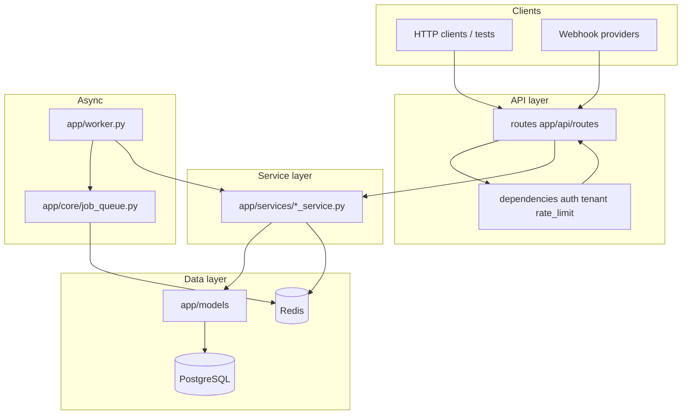

# System Mental Map

High-level picture of how this repository is organized. Read
`00-current-state-audit.md` first for what is actually built.

## One-sentence architecture

**FastAPI** receives HTTP requests → **thin routes** call **services** (business
logic) → **SQLAlchemy models** talk to **PostgreSQL**; **Redis** backs rate
limits, cache, queues; a separate **worker** process runs async jobs.

## Layer diagram

## Directory responsibilities

| Path | Responsibility |
|------|----------------|
| `app/main.py` | Create FastAPI app, register routers, exception handlers |
| `app/api/routes/` | HTTP: parse input, auth, call service, return schema |
| `app/api/dependencies/` | Reusable auth, tenant, rate limit, idempotency |
| `app/services/` | Business rules, DB transactions, `DomainError` |
| `app/models/` | SQLAlchemy tables |
| `app/schemas/` | Pydantic request/response shapes |
| `app/core/` | Config, security, Redis, metrics, middleware |
| `app/db/` | Engine, session factory, `get_db` dependency |
| `app/worker.py` | Poll Redis queue, run jobs, maintenance |
| `alembic/versions/` | Schema migrations |
| `tests/` | Pytest — behavior contract for CI |

## Two “products” in one repo

1. **Foundation** — auth, users, tenants, files, webhooks, admin, worker infra.
2. **Appointment SaaS** — business, staff, service, hours, exceptions, customer,
   booking, availability — nested under `/api/v1/businesses/{id}/...`.

Both share tenancy, auth, DB, Redis, worker.

## External dependencies (local dev)

| Service | Role |
|---------|------|
| PostgreSQL | Primary data |
| Redis | Rate limit, cache, job queue, token revocation |
| MinIO | S3-compatible file storage |

Started via `docker compose` (see `Makefile` `bootstrap` / `validate`).

## Configuration spine

`app/core/config.py` ← `.env` / environment variables ← `docker-compose.yml`

Production safety checks live in `validate_production_settings()` — read before
changing defaults.

## Where to go next

| Question | Doc |
|----------|-----|
| Which file does what? | `02-file-by-file-map.md` |
| One HTTP request end-to-end? | `03-request-flow-map.md` |
| Salon/booking entities? | `04-domain-model-map.md` |
| How do I change X safely? | `05-how-to-change-common-things.md` |
