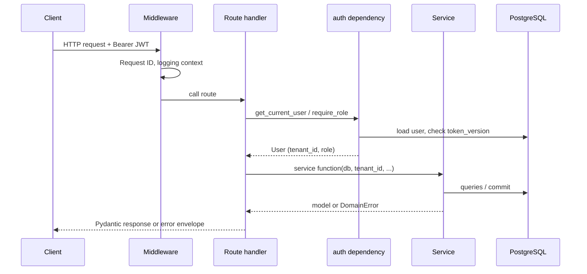
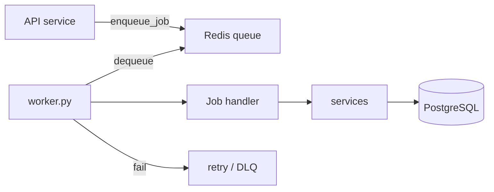

# Request Flow Map

How a request moves through the system. All paths assume Docker Compose stack
running (`make bootstrap` or CI).

## Standard authenticated API request

### Error mapping

| Raised in service | HTTP | Handler |
|-------------------|------|---------|
| `NotFoundError` | 404 | `domain_error_handler` |
| `ConflictError` | 409 | same |
| `HTTPException` | * | route/dependency only |
| Unhandled | 500 | `unhandled_exception_handler` (no stack in prod) |

Services must **not** raise `HTTPException` (see `.ai-rules/architecture.md`).

---

## Example: create booking

**Route:** `POST /api/v1/businesses/{business_id}/bookings`  
**File:** `app/api/routes/bookings.py`

1. `require_role("admin")` — only admin JWT.
2. `create_booking_endpoint` reads `BookingCreate` schema.
3. `create_booking(db, tenant_id=current_user.tenant_id, ..., actor_id=current_user.id)`.
4. Service validates business/customer/service/staff belong to tenant.
5. `_check_double_booking` — app-level overlap check.
6. `db.flush()` + audit log + `db.commit()` — DB `EXCLUDE` constraint is backstop.
7. Returns `BookingRead` schema.

**Tests:** `tests/test_bookings.py`, `tests/test_concurrency.py`, `tests/test_booking_audit.py`

---

## Example: get availability

**Route:** `GET /api/v1/businesses/{business_id}/availability?service_id=&staff_id=&date=`  
**File:** `app/api/routes/availability.py`

1. Auth + load business in tenant.
2. `availability_service` loads working hours, exceptions, existing bookings.
3. Generates slots in business timezone (`zoneinfo`).
4. Returns list of slot datetimes.

**Tests:** `tests/test_availability.py`

---

## Auth flow (login)

1. `POST /auth/login` → `auth_service.authenticate_user`.
2. Returns access + refresh JWT (`app/core/security.py`).
3. Access token carries `sub`, `tenant_id`, `jti`; validated on each request.
4. Refresh rotation + Redis `jti` blocklist → revocation on password reset / deactivate.

**Tests:** `tests/test_auth.py`, `tests/test_access_token_revocation.py`

---

## Tenancy flow

1. User belongs to one `tenant_id` (JWT claim).
2. Product services call `require_business(db, id, tenant_id)` etc.
3. Queries always filter `Model.tenant_id == tenant_id`.
4. Optional header `X-Tenant-Slug` must match JWT tenant on some paths.

**Tests:** `tests/test_product_tenant_isolation.py`, `tests/test_tenant_isolation.py`

---

## Webhook flow

1. External provider `POST /api/v1/webhooks/...`
2. Signature verified (`app/core/webhook_security.py`).
3. Idempotency key dedupes retries (`idempotency_service.py`).
4. Event stored; handler logic in `webhook_service.py`.

**Tests:** `tests/test_webhooks.py`, `tests/test_idempotency.py`

---

## Background worker flow

**Job types today (examples):**

- `send_password_reset_email`
- `verify_presigned_upload`
- Maintenance: audit cleanup, idempotency expiry, webhook cleanup

**Not yet:** SMS/calendar jobs (EPIC E/F).

**Tests:** `tests/test_worker.py`, `tests/test_job_queue.py`

---

## CI request flow (push to main)

1. GitHub Actions: `pre-commit` → `policy-guards` → `test` (pytest + cov) →
   `load-smoke` → `docker-build` + Trivy.
2. Policy guards: migration/model pairing, no destructive `upgrade()`, AI trailer check.

See `docs/ci-policy-guards.md`.
