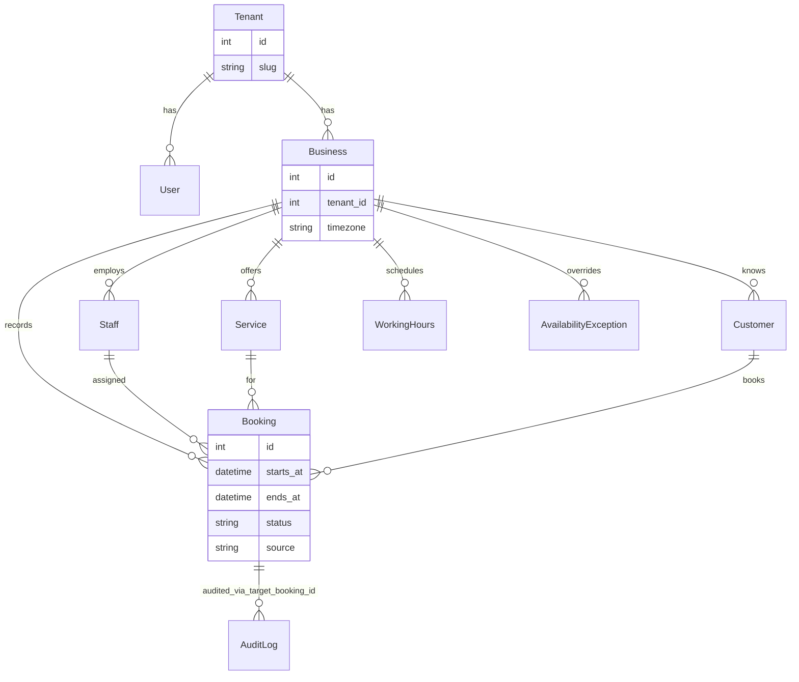

# Domain Model Map (Appointment Voice SaaS)

Entities that exist **in code today**. Planned-only concepts (VoiceSession,
NotificationOutbox) are in roadmap, not migrations.

## ER-style diagram (implemented tables)



## Entity cheat sheet

| Entity | Business meaning | Key fields | Service entrypoints |
|--------|------------------|------------|---------------------|
| **Tenant** | SaaS customer (salon org on platform) | `slug` | `tenant_service.py` |
| **Business** | One salon/location | `timezone`, phone | `create_business`, `require_business` |
| **Staff** | Person who performs services | `name`, active | `create_staff`, `require_staff` |
| **Service** | Bookable offering | `duration_minutes` | `require_service` |
| **WorkingHours** | Weekly open windows | day, start/end time | `working_hours_service.py` |
| **AvailabilityException** | Closure or special hours | date range, closed flag | `availability_exception_service.py` |
| **Customer** | Caller/client | normalized `phone` | `get_or_create_customer` |
| **Booking** | Appointment record | `CONFIRMED` / `CANCELLED`, `source` | `create_booking`, `cancel_booking` |

## Booking lifecycle (implemented)

```
CONFIRMED  ──cancel──▶  CANCELLED
   ▲
   └── create (API or future IVR)
```

- **Double booking:** prevented by app check + PostgreSQL `EXCLUDE` on staff time ranges.
- **Audit:** `booking.created` / `booking.cancelled` in `audit_logs` with `target_booking_id`, `admin_id`, `source`.

## Availability logic (implemented)

Inputs:

1. Business timezone
2. Service duration → slot length
3. Staff working hours
4. Minus availability exceptions
5. Minus existing **CONFIRMED** bookings for that staff

Output: list of start times a client can book.

## Customer model (partial)

- Exists in DB; created via `customer_service.get_or_create_customer` (phone dedupe).
- **No** public `/customers` REST CRUD yet — bookings reference `customer_id`.
- Roadmap does not explicitly list customer API; treat as **partial**.

## Source of truth rules (ADR 0002)

| Data | Source of truth |
|------|-----------------|
| Bookings | PostgreSQL |
| Calendar (future) | Adapter/view — not truth yet |
| SMS (future) | Outbox table — not implemented |

## Tenancy rule (every product row)

All product tables include `tenant_id`. Services must never load by PK alone without
tenant filter.

## What is NOT in the domain model yet

- `VoiceSession`, IVR state
- `NotificationOutbox`, SMS templates
- `CalendarEvent`, provider tokens
- Plans, subscriptions, billing

See `docs/appointment-saas-roadmap.md` EPIC E–J.
