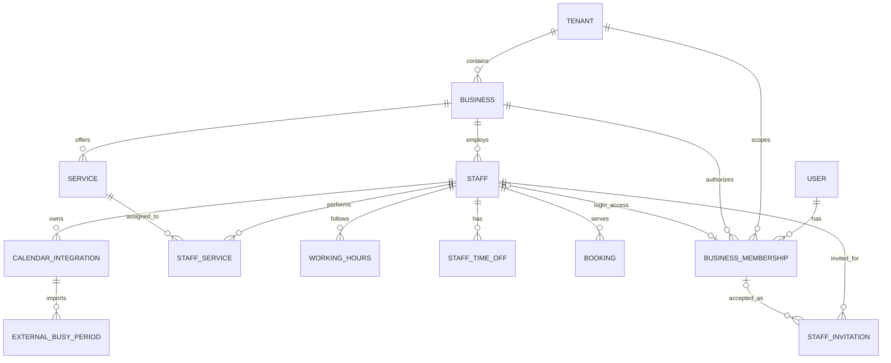
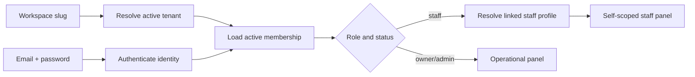
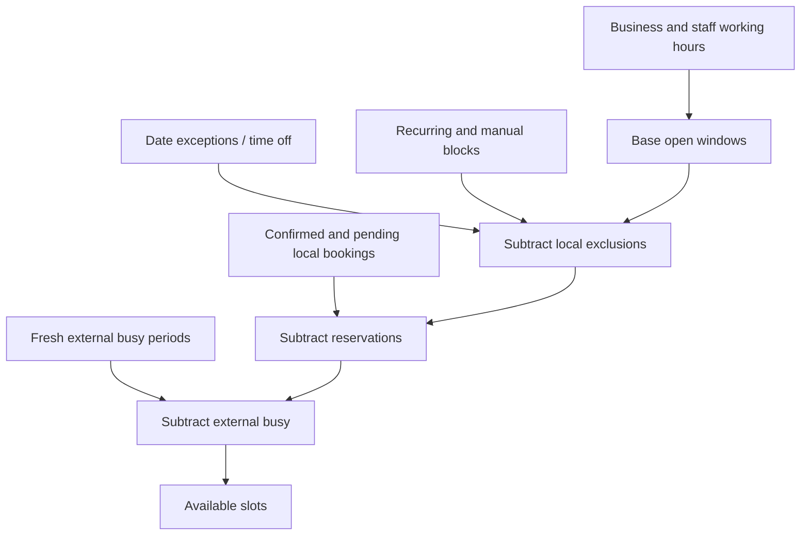

# Staff Access, Scheduling, and Calendar Integrations

- **Status:** Planned
- **Current state:** [`docs/project/current-state.md`](../project/current-state.md)
- **Historical audit:**
  [`docs/archive/audits/staff-access-calendar-current-state.md`](../archive/audits/staff-access-calendar-current-state.md)
- **Decisions:** [ADR 0007](../adr/0007-separate-staff-records-from-login-identities.md),
  [ADR 0008](../adr/0008-external-busy-periods-as-availability-exclusions.md)
- **Execution plan:**
  [`docs/project/implementation-backlog.md`](../project/implementation-backlog.md)

## Objective

Add a tenant-safe employee access model without requiring every salon worker
to have a login. Give invited staff a self-scoped panel, a local calendar, and
optional read-only external-calendar busy import while keeping local bookings
as the sole source of truth.

## Problem and user stories

An owner/admin needs to manage people as business resources even when they do
not use the panel. A staff member who is invited needs access only to their own
profile, schedule, absences, bookings, and calendar integration. External
calendars should prevent offering already-busy time, but must never create,
modify, or cancel local bookings.

## Decision labels

Every target statement uses one of these labels:

- **Existing:** implemented now.
- **Recommended:** preferred target, subject to implementation validation.
- **Required:** security/correctness prerequisite.
- **Optional:** useful extension.
- **Deferred:** explicitly outside MVP.

## Domain boundary

### Employee, user, and membership

- **Existing:** retain physical model/table `Staff`/`staff` as the employee
  business record for the first migration. “Employee” is UI/domain language.
- **Required:** `User` is a global login identity. It owns email/password and
  account-wide security state; it owns no business role.
- **Required:** `BusinessMembership` links one user to one tenant/business and
  stores role and access status. Authorization is membership-based.
- **Required:** `Staff` may exist without a membership. An active staff
  membership must point to exactly one staff record in that business; a staff
  record can have at most one active membership.
- **Recommended:** owner/admin memberships may have no staff link. If an owner
  also takes appointments, they may link to a staff record and use own-calendar
  operations without losing owner privileges.
- **Required:** access revocation deactivates membership and invalidates active
  sessions; it does not delete `Staff`, bookings, or audit history.



## Target data model

Logical names below must be adapted to repository naming during each model
task. All product rows are tenant- and business-scoped even when derivable from
foreign keys; service queries must validate all scope columns.

### `users`

- **Responsibility:** login identity and account security.
- **Fields:** `id`, normalized email, password hash, active state,
  `token_version`, timestamps.
- **Migration:** current `(tenant_id,email)` identities cannot be safely merged
  automatically because the same email can have different passwords. MVP may
  retain `tenant_id` temporarily while membership becomes authoritative;
  global identity consolidation is **Deferred** behind an explicit account-link
  flow.
- **Constraint:** do not introduce global email uniqueness until duplicate
  cross-tenant identities are audited and linked intentionally.
- **Deletion:** deactivate; hard deletion only under a separate privacy process
  that preserves business history and audit referential integrity.

### `business_memberships`

- **Responsibility:** user access to one tenant/business.
- **Fields:** `id`, `tenant_id`, `business_id`, `user_id`, nullable `staff_id`,
  `role` (`owner|admin|staff`), `status`
  (`invited|active|suspended|revoked`), invited/accepted/revoked timestamps,
  actor IDs, created/updated timestamps.
- **Constraints:** unique `(business_id,user_id)`; partial unique active
  `(business_id,staff_id)` where staff is not null; staff role requires
  `staff_id`; role owner cannot be issued by a staff invitation.
- **Indexes:** `(tenant_id,business_id,status)`, `user_id`, `staff_id`.
- **Lifecycle:** invitation may reserve an invited membership or create it
  atomically at acceptance. Revocation is soft and increments user/session
  authorization version.
- **Deletion:** no cascading deletion of staff/bookings. Ownership transfer
  must guarantee at least one active owner.

### `staff` (Employee)

- **Responsibility:** person/resource used by services, schedules, bookings,
  transfer, and calendars, independent of login.
- **Fields added:** contact email, position/title, `accepts_bookings`,
  `is_customer_visible`, updated timestamp; keep name/phone/active.
- **Constraints/indexes:** existing tenant/business indexes; normalized contact
  email may be non-unique because it is contact data, not identity.
- **Lifecycle:** active/inactive. Deactivation prevents new booking assignment
  but preserves existing bookings, schedules, and audit history.
- **Deletion:** soft deactivation by default; hard delete only if no business
  history and no access/audit references.

### `staff_services`

- **Responsibility:** services an employee can perform.
- **Fields:** `tenant_id`, `business_id`, `staff_id`, `service_id`, active state,
  timestamps.
- **Constraints:** unique `(staff_id,service_id)` and same-business validation.
- **Deletion:** deactivate or delete association; never alter historical booking
  service/staff fields.

### `working_hours`

- **Existing:** reuse current model and precedence.
- **Recommended:** add uniqueness/overlap validation per staff/day and audit
  actor metadata only if implementation needs it. Do not duplicate schedules
  into a new employee table.

### `staff_time_off`

- **Responsibility:** explicit one-off employee absence lifecycle.
- **Fields:** `tenant_id`, `business_id`, `staff_id`, timezone-aware start/end,
  optional safe reason/category, status, created_by membership, timestamps.
- **Constraints:** end after start; index `(staff_id,starts_at,ends_at)`.
- **Migration:** staff-specific closed `AvailabilityException` rows can be
  backfilled only when their meaning is unambiguous. Preserve original rows
  until parity checks pass; do not reinterpret special opening hours as leave.
- **Deletion:** future staff-created records can be deleted/soft-cancelled;
  past records remain auditable.

### `staff_blocked_periods`

- **Recommended:** use a dedicated model for one-off manual blocks if product
  semantics differ from time off. Recurring breaks continue to use
  `RecurringStaffBlock`.
- **MVP option:** one-off blocks may initially share `staff_time_off` with a
  typed category, provided API and audit semantics remain explicit.

### `staff_invitations`

- **Responsibility:** one-time staff panel access grant.
- **Fields:** `tenant_id`, `business_id`, `staff_id`, normalized email,
  `role` fixed to staff/admin-safe values, token hash, expiry, used/revoked
  timestamps, invited/accepted membership/user IDs, inviter membership ID,
  created timestamp.
- **Constraints:** one active invitation per `(business_id,staff_id,email)`;
  token hash unique; role cannot be owner.
- **Indexes:** token hash, active invitation lookup, expiry sweep.
- **Lifecycle:** pending, accepted, expired, revoked. Resend revokes previous
  token and creates a new token; raw token exists only during link creation.
- **Deletion:** retain safe metadata/audit record; never retain raw token.

### `calendar_integrations`

- **Existing:** reuse current tenant/business/staff integration row and partial
  uniqueness, but evolve it beyond outbound destination settings.
- **Fields added:** integration kind/provider, connection status, encrypted
  credential payload or encrypted ICS URL, selected calendar ID, scopes,
  last attempt/success, safe error code/message, credential version, revoked
  timestamp.
- **Constraints:** one active inbound integration per staff for MVP; tenant,
  business, and staff must agree. A staff self endpoint never accepts staff ID.
- **Secrets:** envelope encryption with a versioned application key/KMS
  abstraction; never return ciphertext or raw secret; display only provider,
  masked identifier, status, and sync timestamps.
- **Disconnect:** revoke provider token where possible, clear encrypted secret,
  deactivate integration, and remove/expire imported busy periods.

### `external_busy_periods`

- **Responsibility:** normalized read-only availability exclusions.
- **Fields:** `tenant_id`, `business_id`, `staff_id`, integration ID, provider
  event hash/opaque key, starts/ends UTC, source revision, observed/synced/
  expires timestamps.
- **Privacy:** no event title, attendees, description, location, or customer
  data.
- **Constraints/indexes:** unique `(integration_id,provider_event_key,start)` or
  provider-appropriate idempotency key; range indexes by staff/time.
- **Lifecycle:** refresh by idempotent upsert; stale periods expire by policy;
  disconnect removes or invalidates them.
- **Deletion:** safe to purge after expiry because they are derived cache, not
  booking history.

### `bookings`

- **Existing:** remains the sole source of truth for app-created reservations.
- **Required:** preserve optional staff link and history when staff/membership
  is deactivated. Never cascade-delete bookings.
- **Recommended:** calendar read responses join safe service/customer display
  fields; staff receives the minimum customer fields required to deliver the
  appointment.

## RBAC model

Backend authorization is authoritative. Frontend navigation only improves UX.
Owner implies all tenant-business operational permissions plus ownership and
billing. Admin receives operational permissions but cannot manage ownership,
billing/subscription, or company deletion. Staff operations are self-scoped.

| Operation | Owner | Admin | Staff |
|-----------|:-----:|:-----:|:-----:|
| List/read all employees | yes | yes | no |
| Create/edit/deactivate/reactivate employee | yes | yes | no |
| Edit own employee profile | yes if linked | yes if linked | limited fields |
| Assign employee services | yes | yes | no |
| Manage another employee schedule/time off | yes | yes | no |
| Invite/resend/revoke panel access | yes | yes | no |
| Assign `admin` role | yes | no | no |
| Assign/transfer `owner` role | owner-only guarded flow | no | no |
| Read all calendars/bookings | yes | yes | no |
| Read own calendar/bookings | yes if linked | yes if linked | yes |
| Manage own future time off | yes if linked | yes if linked | yes |
| Read own working hours/services | yes if linked | yes if linked | yes |
| Edit own regular working hours | yes if policy enabled | yes if policy enabled | no in MVP |
| Connect/disconnect own calendar | yes if linked | yes if linked | yes |
| Manage another employee integration | yes | yes | no |
| Configure business-wide integration | yes | optional policy | no |
| Manage services/prices | yes | yes | no |
| Manage users/roles | yes | limited operational roles | no |
| Billing/subscription | yes | no | no |
| Delete business/transfer ownership | yes | no | no |
| Platform administration | no | no | no |

**Required enforcement:** resolve an `AuthorizationContext` from authenticated
user + selected workspace/business membership. It must include tenant,
business, membership, role, status, and nullable linked staff ID. Self endpoints
derive staff ID from this context. Object loaders always filter tenant and
business before testing ownership; cross-scope objects return 404, while a
known in-scope but disallowed operation returns 403.

## Invitation flow

```mermaid
sequenceDiagram
    actor Owner as Owner/Admin
    participant FE as Frontend BFF
    participant API as FastAPI
    participant DB as PostgreSQL
    participant Mail as Email worker
    actor Staff as Employee

    Owner->>FE: Invite employee
    FE->>API: POST employee invite
    API->>DB: Lock staff; revoke old pending token; store token hash
    API->>Mail: Enqueue email after commit
    Mail-->>Staff: One-time HTTPS link
    Staff->>FE: Open link and set password/link identity
    FE->>API: Accept raw token once
    API->>DB: Lock invitation; verify hash/expiry/scope
    API->>DB: Create/link user + active membership + staff link atomically
    API->>DB: Mark invitation used; audit; invalidate authorization cache
    API-->>FE: Success; require workspace login
```

### Invitation requirements

1. **Required:** generate at least 256 bits of randomness; store only a keyed
   or cryptographic hash; compare in constant time.
2. **Required:** 24-72 hour configurable expiry, one use, explicit revoke,
   resend invalidating the old token, rate limits per actor/staff/email/IP.
3. **Required:** generic invalid/expired response to prevent token/email
   enumeration; never log raw token or include it in analytics/referrers.
4. **Required:** acceptance uses one transaction and row lock. Unique
   constraints prevent duplicate membership and duplicate staff links.
5. **Required:** token binds tenant, business, staff, email, and allowed role.
   Staff invitations cannot grant owner.
6. **Recommended:** when an existing same-email identity is found, require
   authentication to that identity before linking; do not silently attach it.
7. **Required:** no password is sent by email. Acceptance sets a password for a
   new identity or links an authenticated existing identity.

## Staff login and authorization



- **Recommended MVP compatibility:** continue workspace + email + password.
  Resolve the user identity and active membership in that workspace/business.
- **Required:** access token must identify user, tenant, and authorization
  version. Membership ID may be included only as a hint; backend reloads active
  membership/role. Do not trust a mutable role claim without version checking.
- **Required:** membership revoke/suspend and role change invalidate current
  sessions. A linked staff deactivation prevents staff panel access according
  to policy but does not erase identity/history.

## Internal calendar and availability

### Source of truth

- **Existing:** local `Booking` rows are authoritative for reservations.
- **Existing:** `WorkingHours` defines base recurring availability.
- **Existing:** `AvailabilityException` and `RecurringStaffBlock` define local
  schedule changes/blocks until dedicated time-off is introduced.
- **Recommended:** `StaffTimeOff` and one-off blocked periods become explicit
  local exclusions.
- **Required:** imported external periods are read-only exclusions. They can
  suppress offered slots but never mutate local bookings.
- **Required:** provider outage/staleness never deletes or moves a booking.



### Calendar read model

- **Recommended MVP:** agenda plus week view; agenda is the smallest complete
  mobile view, week supports salon operations. Day view is a filter, not a
  separate interaction model. Drag/drop is **Deferred**.
- **Required response:** bounded `from`/`to`, business timezone, booking ID,
  starts/ends, service display name, status, item kind (`booking|time_off|
  blocked`), and customer fields filtered by permission.
- **Required:** external busy displays as generic “Busy”; do not expose event
  metadata. Working hours may render as background availability.
- **Required:** query ranges are capped (for example 31 days) and indexed.
- **Recommended:** compose a read DTO in a service; do not persist duplicate
  local calendar-event rows.

### Staff autonomy

- **MVP:** view own profile/services/hours/bookings; create/update/delete own
  future time off; connect/disconnect own calendar.
- **Required:** staff cannot edit past time off; cannot choose `staff_id`; all
  self mutations are audited and conflict checked.
- **Optional:** allow own regular-hours edits under a business policy.
- **Deferred:** booking status edits, shift swaps, leave approval, drag/drop.

## External calendar integrations

### Common controls

- **Required:** integration belongs to tenant + business + staff and is resolved
  from authorization context for staff self-service.
- **Required:** encrypted-at-rest secrets with key versioning; secret fields are
  redacted from schemas, structured logs, traces, audit payloads, and errors.
- **Required:** imported values are normalized to UTC while preserving business
  timezone for display/DST calculation.
- **Recommended:** idempotent polling jobs reuse existing queue/retry/DLQ and
  reconciliation patterns in `app/worker.py` and
  `app/services/reconciliation_service.py`.
- **Recommended stale policy:** do not offer externally blocked time if the
  last successful sync exceeds a configurable safety threshold; surface
  degraded status to owner/staff and retry. Exact fail-open/fail-closed policy
  must be selected per pilot risk before launch.

### ICS/iCal read-only

- **Recommended Pilot:** implement before Google OAuth because it is provider
  neutral, read-only, and validates the busy-period model. It still carries
  high SSRF and secret-URL risk.
- **Required:** accept only an HTTPS feed URL, never a calendar webpage URL;
  fetch server-side; parse only time ranges needed for a bounded horizon.
- **Required SSRF controls:** parse/canonicalize URL; reject credentials and
  non-HTTPS schemes; resolve DNS and reject unspecified, loopback, private,
  link-local, multicast, reserved, and cloud metadata ranges for IPv4/IPv6;
  connect to the validated address while preserving TLS hostname validation;
  repeat validation after every redirect; cap redirects; prevent DNS
  rebinding; enforce connect/read timeout, response-byte limit, decompression
  limit, event/count/horizon limit, and accepted calendar content types.
- **Required:** outbound egress policy/firewall is defense in depth. Application
  validation alone is insufficient.
- **Required:** store encrypted URL, return only masked host/provider status,
  never log full URL/query/token. Test connection uses the same safe fetcher.
- **Required:** ICS is read-only; imported occurrences become generic busy
  periods. Handle recurrence/timezones with a maintained parser, not ad-hoc
  string processing.

### Google Calendar OAuth read-only

- **Recommended Pilot/Later:** request the minimum free/busy/read-only scope;
  do not request event write access for MVP.
- **Required:** begin connect from authenticated membership; store a short-lived,
  single-use, server-side OAuth transaction bound to user, membership, staff,
  tenant, business, PKCE verifier, nonce/state, return path, and expiry.
- **Required:** callback validates exact state/PKCE and redirect URI, exchanges
  code server-side, verifies scopes, encrypts refresh/access credentials, and
  never accepts a client-provided staff ID.
- **Required:** refresh is locked/idempotent; revoked/expired credentials set a
  reconnect-required state without exposing provider payloads.
- **Required:** disconnect revokes provider grant where possible, erases local
  credentials, deactivates integration, and expires busy periods.
- **Deferred:** writing bookings to Google under employee OAuth. Existing
  outbound adapter work can be evaluated separately only after idempotency,
  duplicate, deletion, retry, and source-of-truth policies are specified.

## API plan

Paths retain the repository's business-scoped convention. Names are logical
until implementation specs validate OpenAPI consistency.

### Owner/admin employee management

| Operations | Roles | Scope and behavior |
|------------|-------|--------------------|
| `GET/POST /businesses/{business_id}/staff` | owner/admin | list/create tenant+business scoped; staff gets 403 |
| `GET/PATCH /businesses/{business_id}/staff/{staff_id}` | owner/admin | 404 for cross-scope ID; preserve immutable history |
| `POST .../{staff_id}/deactivate` and `/reactivate` | owner/admin | idempotent; 409 for invalid lifecycle/conflicting access policy |
| `PUT .../{staff_id}/services` | owner/admin | validate every service in same business; idempotent replacement or explicit delta |
| `GET/PUT .../{staff_id}/schedule` | owner/admin | overlap validation; timezone explicit |
| `GET .../{staff_id}/calendar?from=&to=` | owner/admin | bounded range; minimum customer data |
| `POST .../{staff_id}/invite`, `/invite/resend`, `/invite/revoke` | owner/admin | role ceiling; rate limit; audit; resend/revoke idempotency |
| `GET/DELETE .../{staff_id}/calendar-integration` | owner/admin | inspect safe status/disconnect; secrets never returned |

### Staff self-service

| Operations | Roles | Scope and behavior |
|------------|-------|--------------------|
| `GET/PATCH /businesses/{business_id}/me/staff-profile` | linked membership | derive staff ID; PATCH allowlist only |
| `GET /businesses/{business_id}/me/calendar?from=&to=` | linked membership | own events only; no `staff_id` parameter |
| `GET /businesses/{business_id}/me/availability` | linked membership | own hours/exclusions/status |
| `GET/POST/PATCH/DELETE /businesses/{business_id}/me/time-off` | linked membership | own future records; 409 on invalid/conflicting lifecycle |
| `GET /businesses/{business_id}/me/calendar-integration` | linked membership | safe metadata only |
| `POST .../calendar-integration/ics` and `/test` | linked membership | safe fetcher; idempotency key on create/test where useful |
| `POST .../calendar-integration/google/connect` | linked membership | returns authorization redirect intent; server-bound state |
| `GET /calendar-integrations/google/callback` | OAuth transaction | callback is not a generic employee endpoint |
| `DELETE .../me/calendar-integration` | linked membership | idempotent disconnect |

### Error policy and tests

- `401`: missing/invalid/expired authentication or invalid OAuth transaction.
- `403`: authenticated membership lacks operation/role/self scope.
- `404`: resource absent or outside tenant/business scope; do not reveal IDOR.
- `409`: duplicate membership/invitation, lifecycle conflict, schedule/time-off
  conflict, or integration already connected in an incompatible state.
- Every write requires tenant-isolation, role-matrix, object-substitution,
  idempotency/race, audit, and session-revocation tests as applicable.

## Frontend information architecture

### Owner/admin routes

- **MVP:** `/dashboard/employees`, `/dashboard/employees/new`,
  `/dashboard/employees/[id]` with profile/services/schedule/access tabs, and
  `/dashboard/employees/[id]/calendar`.
- **Pilot:** employee integration status/manage view.
- **Deferred:** bulk import, advanced calendar editing, shift planning.

### Staff routes

- **MVP:** `/staff/calendar`, `/staff/availability`, `/staff/time-off`,
  `/staff/profile`, `/staff/calendar-integration`.
- **Required:** server layout loads session + active membership context and
  renders role-specific navigation. Direct URL access is checked by backend;
  frontend guard is not the security boundary.
- **Required:** Server Components load initial profile/calendar/status data;
  Client Components handle bounded calendar navigation, forms, dialogs,
  connect/disconnect, and mutations.
- **Required:** BFF handlers retain HttpOnly tokens, forward workspace context,
  apply CSRF controls to mutations, map 401 to refresh/login, and render a
  dedicated 403 state rather than redirect loops.
- **Recommended reuse:** current dashboard layout, auth refresh wrapper, BFF
  fetch helpers, staff forms, query provider, and booking display components.
- **Required states:** no integration, connecting, connected/healthy, stale,
  reconnect required, safe sync error, and disconnected. ICS displays masked
  origin only.

## Threat model

| Risk | Impact | Likelihood | Mitigation | Tests/enforcement | Roadmap |
|------|--------|------------|------------|-------------------|---------|
| Cross-tenant/business IDOR | Critical data breach | Medium | scoped loaders + membership context + 404 | matrix/object substitution tests | SAC-005, 008, 024 |
| Staff privilege escalation/role self-edit | Critical | Medium | role absent from self schemas; owner-only ceilings | negative API tests, audit | SAC-005, 024 |
| Staff supplies another `staff_id` | High privacy breach | High if accepted | `/me` derives link; reject field | contract/fuzz tests | SAC-005, 015 |
| Stolen invitation token | High account takeover | Medium | short TTL, hash, HTTPS, rate limit, revoke | token leak/expiry tests | SAC-010, 011 |
| Invitation replay/race | High duplicate access | Medium | row lock, used timestamp, unique constraints | concurrent acceptance test | SAC-011 |
| Duplicate membership/staff link | High authorization ambiguity | Medium | unique and partial unique constraints | migration/concurrency tests | SAC-004, 011 |
| Staff invited as owner | Critical | Low | schema/DB/service role ceiling | negative tests | SAC-010 |
| Private ICS URL exposure | High secret leak | Medium | encryption, schema/log redaction | serialization/log tests | SAC-019, 020 |
| ICS SSRF/DNS rebinding/redirect | Critical infrastructure access | High | validated pinned fetcher + egress controls | malicious DNS/redirect corpus | SAC-020 |
| OAuth token in logs | High provider takeover | Medium | centralized redaction/encrypted store | log capture tests | SAC-019, 022 |
| OAuth CSRF/state omission | High account misbinding | Medium | state+PKCE+server transaction | callback mismatch/replay tests | SAC-022 |
| Customer data exposed in staff calendar | High privacy breach | Medium | minimal DTO and self scope | response snapshot/role tests | SAC-015, 024 |
| Staff reads coworker bookings | High privacy breach | High under current routes | replace authenticated reads with role/self policy | route matrix tests | SAC-005, 015 |
| Staff deletion loses booking history | High integrity loss | Medium | soft deactivate; restrictive FKs | migration/lifecycle tests | SAC-006, 008 |
| Local/external conflict | Medium missed slot/revenue | High | deterministic subtraction; local booking authority | overlap/DST tests | SAC-018, 023 |
| Provider outage/stale import | Medium overbooking or closure | High | status, retry, freshness policy, alert | worker/failure tests | SAC-021, 023 |
| Revoked OAuth credential | Medium stale availability | Medium | reconnect state, safe expiry policy | provider error tests | SAC-022, 023 |
| Secret key compromise/rotation failure | Critical | Low | envelope encryption/versioned rotation | rotation/recovery tests | SAC-019, 024 |
| Timezone/DST error | High wrong availability | Medium | business TZ, UTC storage, DST corpus | timezone tests | SAC-015, 018, 023 |

## Migration and backfill strategy

1. **Required preflight:** inventory duplicate emails across tenants, users per
   tenant, businesses per tenant, admins, orphan/mismatched staff foreign keys,
   staff contact matches, and ambiguous first-owner candidates. Produce counts;
   never auto-link by email alone.
2. **Expand:** add memberships/status/role and staff metadata without removing
   `User.tenant_id`/`role`. Add nullable links and constraints as `NOT VALID`
   where PostgreSQL rollout needs staged validation.
3. **Backfill:** create one membership for each current user and each active
   business they currently manage under the current tenant-wide semantics.
   Map current `admin` to owner only for the deterministic tenant creator when
   audit evidence identifies it; otherwise require operator resolution and map
   additional admins to admin. Map `user` to a suspended/unlinked legacy
   membership until explicitly linked to staff.
4. **Staff linking:** produce candidates from normalized contact email only as a
   report. Link through owner confirmation/invitation, not automatic matching.
5. **Dual-read/dual-enforce:** feature flag membership authorization, compare
   legacy/new decisions in metrics, then make membership authoritative.
6. **Session cutover:** increment token versions; require reauthentication so
   no pre-membership session survives role migration.
7. **Contract:** remove legacy `User.role` and direct tenant authorization only
   after parity, rollback rehearsal, and all routes/workers use membership
   context. Globalize user identity in a separate task if duplicate-account
   linking policy is accepted.
8. **Scheduling data:** preserve current staff IDs so bookings/hours remain
   intact. Backfill dedicated time off only from unambiguous staff closures.
9. **Calendar:** evolve existing integration rows in place; existing outbound
   rows default to outbound mode. Never treat `calendar_id` as a credential.

Rollback retains legacy columns until post-cutover validation. Migrations must
not cascade-delete staff, memberships, users, or bookings. Every destructive
contract step requires backup/restore rehearsal under repository database rules.

## Acceptance criteria

1. Staff records remain valid without user accounts.
2. A user can obtain access only through an active scoped membership.
3. Owner/admin/staff permissions match the matrix in backend tests.
4. Staff self routes cannot address another employee or business.
5. Invitation acceptance is one-time, atomic, tenant-bound, and auditable.
6. Staff can use a local agenda/week calendar without external integration.
7. Availability combines local schedules, exclusions, bookings, and fresh
   external busy periods deterministically.
8. ICS and Google imports reveal no event details and never mutate bookings.
9. Secrets are encrypted and absent from API/log/audit output.
10. Membership migration preserves booking/staff history and has rollback.

## Non-goals

- Implementing any model, migration, endpoint, UI, OAuth, parser, or worker in
  this documentation task.
- Two-way booking state synchronization.
- External-event details, customer data export, drag/drop, shift swaps,
  payroll, leave approval, or global user-account merge in MVP.

## Verification plan for implementation tasks

Each task uses targeted tests first, then `make validate`, migration checks,
tenant isolation tests, frontend lint/type/test/build as applicable, and the
repository's required read-only reviewer. Security-sensitive integration tasks
also require malicious-input test corpora and a threat-model review.
